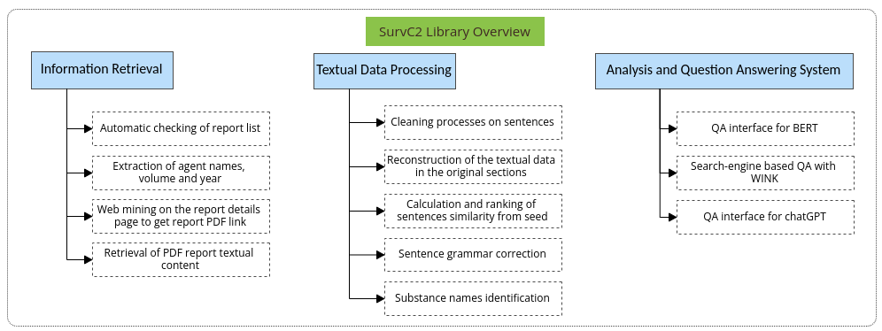

# SurvC2
SurvC2 – a web computing library for FAIR cancer surveillance prompt engineering

Live at: https://epiverse.github.io/survc2/

# Summary
SurvC2 libraries are organized into three main modules: information retrieval, textual data processing and analysis, and a question-answering system. In addition, we present the data source and assessment metrics used to evaluate the performance of three different language models: BERT, Wink, and Generative Pre-trained Transformer (GPT).

